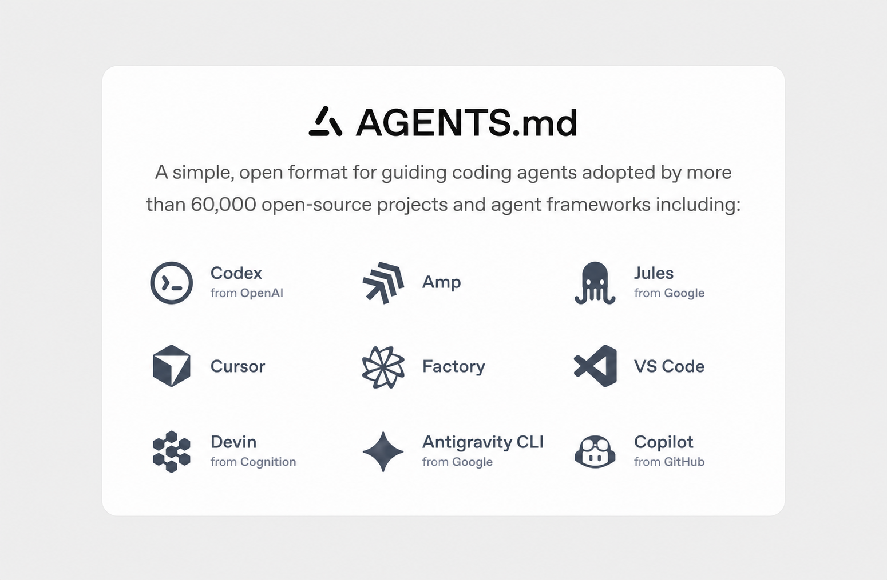

# AGENTS.md



[AGENTS.md](https://agents.md) is a simple, open format for guiding coding agents.

Think of it as a **README for agents**: a dedicated, predictable place to give AI coding agents the context and instructions they need to work effectively on your project.

## Why AGENTS.md?

README files are written for humans: project descriptions, setup instructions, contribution guidelines, and documentation.

AGENTS.md complements them by providing instructions specifically for coding agents, such as:

* How to set up the development environment
* How to build and test the project
* Project conventions and architecture notes
* Code style and linting requirements
* Pull request and commit expectations
* Repository-specific instructions an agent should follow

Keeping these instructions in a dedicated file makes them easier for agents to discover and allows your README to stay focused on human contributors.

## Getting started

Create an `AGENTS.md` file in the root of your repository:

```text
your-project/
├── AGENTS.md
├── README.md
├── package.json
└── src/
```

Then add the instructions an agent should know when working on your project.

For example:

```markdown
# AGENTS.md

## Dev environment tips

- Use `pnpm install` to install dependencies.
- Run `pnpm dev` to start the development server.
- Use `pnpm lint` to check formatting and linting.

## Testing instructions

- Run `pnpm test` before submitting changes.
- Add or update tests for any code you change.
- Make sure all tests and type checks pass.

## PR instructions

- Use clear, descriptive commit messages.
- Keep pull requests focused on a single change.
- Run linting and tests before committing.
```

There is no required set of sections. Use the structure that best communicates how an agent should work in your repository.

## Example

Here is a more detailed example for a monorepo:

```markdown
# Sample AGENTS.md file

## Dev environment tips

- Use `pnpm dlx turbo run where <project_name>` to jump to a package instead of scanning with `ls`.
- Run `pnpm install --filter <project_name>` to add the package to your workspace so Vite, ESLint, and TypeScript can see it.
- Use `pnpm create vite@latest <project_name> -- --template react-ts` to create a new React + Vite package with TypeScript checks ready.
- Check the `name` field inside each package's `package.json` to confirm the correct package name.

## Testing instructions

- Find the CI configuration in the `.github/workflows` directory.
- Run `pnpm turbo run test --filter <project_name>` to run the checks defined for that package.
- From the package root, run `pnpm test`.
- To run a specific test, use `pnpm vitest run -t "<test name>"`.
- Fix test and type errors before submitting changes.
- After moving files or changing imports, run `pnpm lint --filter <project_name>`.
- Add or update tests for the code you change.

## PR instructions

- Title format: `[<project_name>] <Title>`
- Run `pnpm lint` and `pnpm test` before committing.
```

## Writing effective instructions

Good AGENTS.md instructions should be **specific, actionable, and easy to verify**.

Prefer:

```markdown
- Run `pnpm test` before submitting a pull request.
```

Instead of:

```markdown
- Make sure everything works correctly.
```

Prefer documenting commands, conventions, constraints, and expectations that an agent can directly follow.

## Website

This repository also includes the [agents.md](https://agents.md/) website, a Next.js application that explains the project and provides examples.

### Running the website locally

1. Install dependencies:

   ```bash
   pnpm install
   ```

2. Start the development server:

   ```bash
   pnpm run dev
   ```

3. Open http://localhost:3000 in your browser.

## Contributing

Contributions that improve the AGENTS.md format, documentation, examples, or website are welcome.

To contribute:

1. Fork the repository.
2. Create a branch for your change.
3. Make your changes.
4. Run the relevant checks locally.
5. Open a pull request describing what you changed and why.

When contributing documentation, keep examples concise and focused on instructions that are useful to coding agents.

## Learn more

Visit [agents.md](https://agents.md/) to learn more about the format and see additional examples.
